# Rendi Setiawan Jodi — 221011400830 — 07TPLP020

# HealthyBite Drinks (PHP Native)

Aplikasi rekomendasi jus & smoothie berbasis web. Pengguna dapat memilih tujuan minuman (Detox, Energy, Diet, Relax), melihat resep, serta menghitung kalori per porsi.

Admin dapat mengelola resep melalui panel dashboard (CRUD + upload gambar).

Pada versi terbaru, akses resep **hanya untuk member yang sudah login**.

## 🛠 Tech Stack

- PHP 8+
- MySQL / MariaDB (PDO)
- CSS Native (tanpa framework)
- PHP Native — **No Framework**

## ⚙️ Instalasi & Setup (Localhost)

1. Buat database:

`healthy_drinks`

2. Import file:

`healthy_drinks.sql`

3. Duplikat file konfigurasi database

Windows:
`copy inc/db.example.php inc/db.php`

Mac / Linux:
`cp inc/db.example.php inc/db.php`

4. Edit file:

`inc/db.php`

Sesuaikan:
- $DB_USER
- $DB_PASS

(Default XAMPP: user root, password kosong)

5. Jika admin belum tersedia → jalankan script reset / insert admin

6. Buka aplikasi di browser:

`http://localhost/healthy-drinks/`

## 🔐 Akun Login

### Admin (Default)

- Username: `admin`
- Password: `admin111`

### User / Member

- Registrasi melalui halaman **Daftar**
- Hanya user login yang dapat mengakses resep

## ✨ Fitur Aplikasi

### 👥 User / Member

- Registrasi & Login
- Akses resep berdasarkan kategori:
  - Detox
  - Energy
  - Diet
  - Relax
- Filter & pencarian resep
- Sorting:
  - Terbaru
  - Nama A–Z
  - Nama Z–A
- Detail resep + kalkulator porsi kalori
- Mode **Cetak Resep**
- Pembatasan akses resep untuk non-member

### 🛠 Admin Panel

- CRUD Resep (Tambah / Edit / Hapus)
- Upload & Update gambar resep
- Kelola user & admin
- Ubah password admin
- Dashboard ringkasan data

  Bagian berikut merangkum tangkapan layar (screenshots) dari aplikasi HealthyBite Drinks. Semua gambar berada di folder `screenshot/`.

  1. 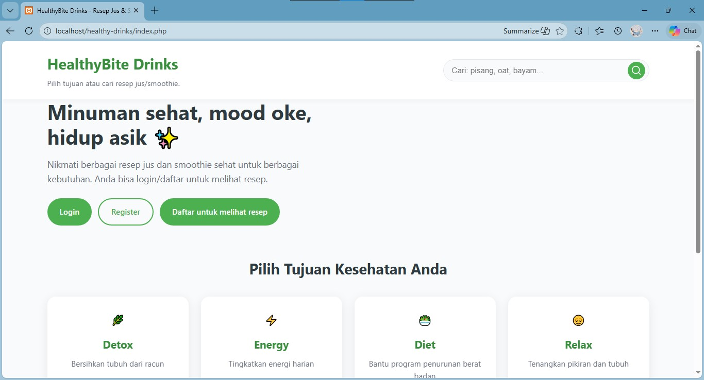

    Halaman Awal (guest) — menampilkan informasi umum tentang kesehatan dan CTA untuk mendaftar/login. Pengunjung belum bisa melihat resep sampai mendaftar.

  2. 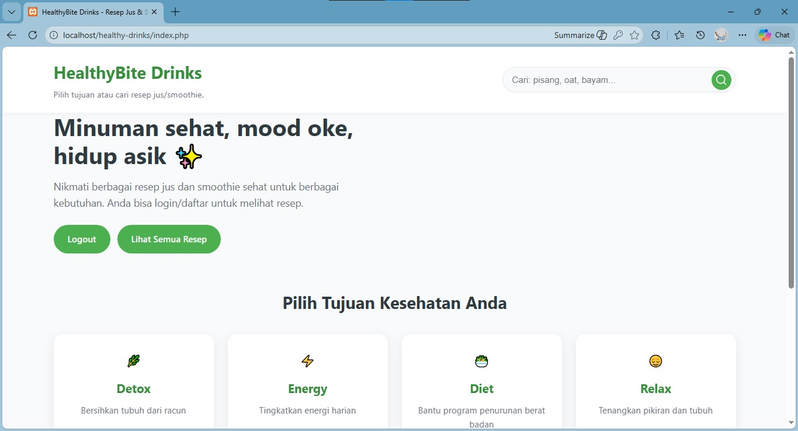

    Halaman beranda user setelah login — menampilkan rekomendasi dan akses untuk melihat resep.

  3. 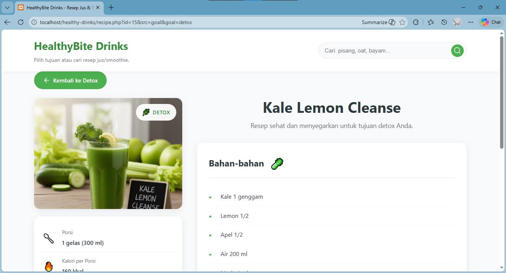

    Tampilan detail resep untuk user yang menampilkan bahan, langkah, dan kalkulator porsi.

  4. 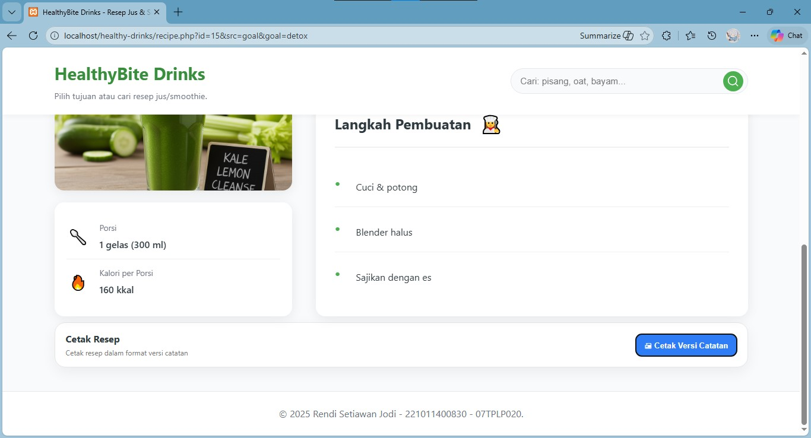

    Opsi cetak resep pada tampilan user (versi catatan yang dapat dicetak).

  5. 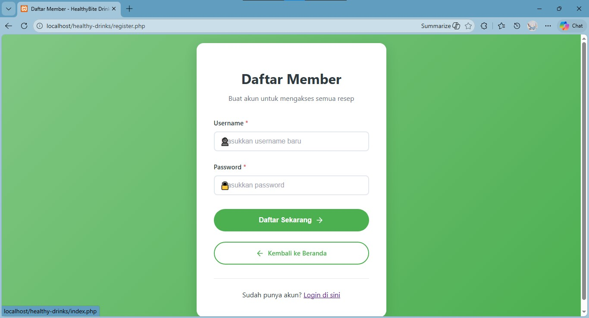

    Form pendaftaran member — digunakan oleh pengunjung untuk membuat akun.

  6. 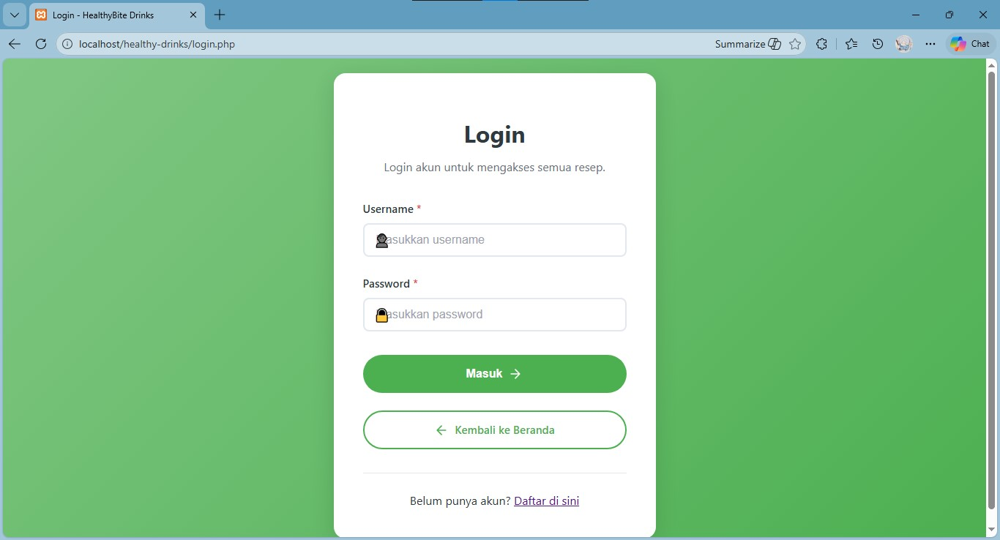

    Form login untuk admin/user.

  7. 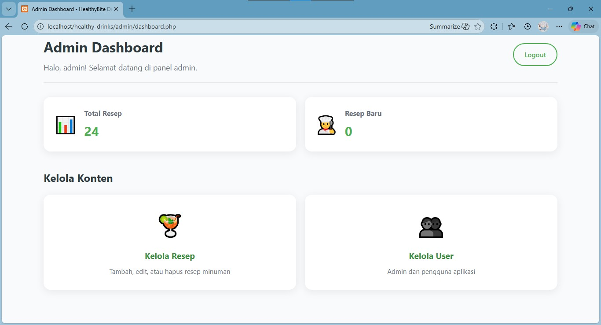

    Dashboard admin — ringkasan statistik dan akses untuk mengelola resep serta pengguna.

  8. 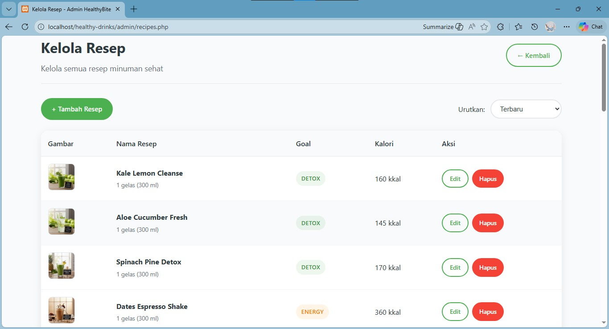

    Halaman list resep di admin — lihat, edit, hapus resep.

  9. 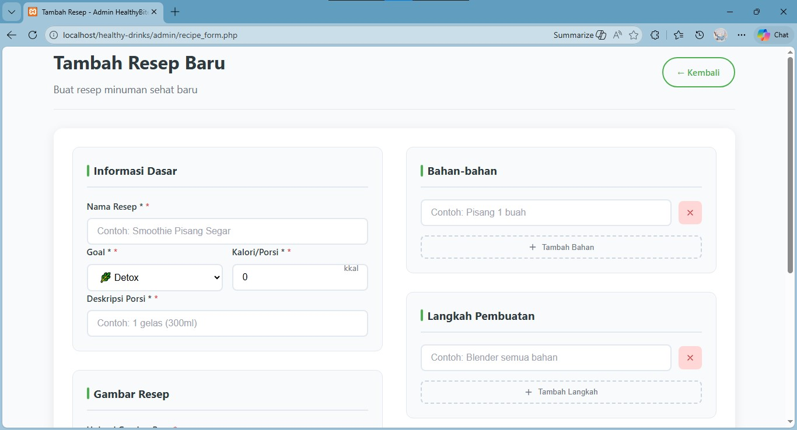

    Form tambah resep pada panel admin.

  10. 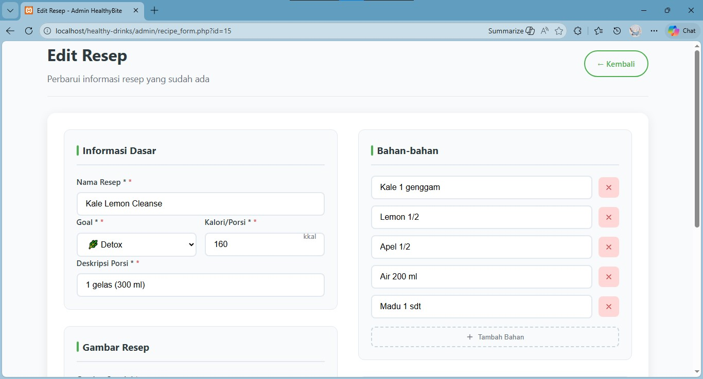

    Form edit resep pada panel admin (ubah nama, bahan, langkah, gambar, dll.).

  11. 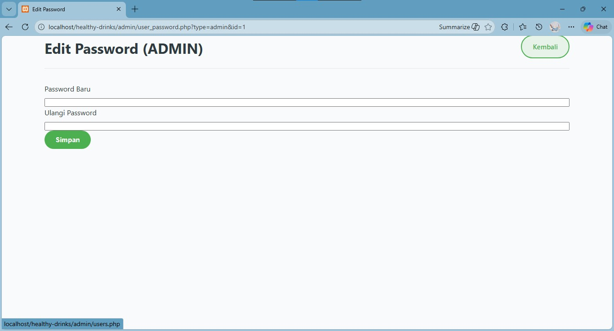

    Form untuk admin mengubah password akun admin lain.

  12. 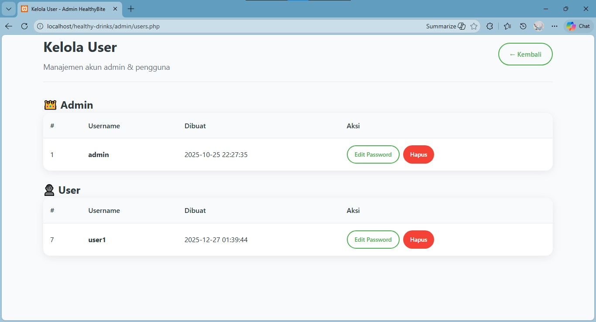

    Halaman manajemen user/admin — edit password, hapus akun.

  📸 Semua screenshot diambil dari localhost (XAMPP). Fitur utama: login admin, CRUD resep, upload gambar, rekomendasi minuman sehat per kategori (detox, energy, diet, relax), dan sortir alphabet.

    Halaman list resep di admin — lihat, edit, hapus resep.

  11. 

    Halaman manajemen user/admin — edit password, hapus akun.

  12. 

    Form login untuk admin/user.

  13. 

    Tampilan detail resep untuk user yang menampilkan bahan, langkah, dan kalkulator porsi.

  14. 

    Form tambah resep pada panel admin.
  >>>>>>> 22692f3 (chore: add screenshots & README updates; restrict recipes to members; small CSS/JS cleanup)

